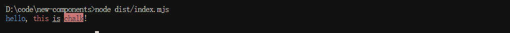

# MarkDown

## MarkDown 基本语法

```md
标题
# H1
## H2
### H3
粗体
**bold text**
斜体
*italicized text*
引用块
> blockquote
有序列表
1. First item
2. Second item
3. Third item
无序列表
- First item
- Second item
- Third item
代码
`code`
分隔线
---
链接
[百度](https://www.baidu.com)
图片

```
::: details 详情
# H1
## H2
### H3
**bold text**

*italicized text*
> blockquote
1. First item
2. Second item
3. Third item
- First item
- Second item
- Third item
  
`code`

---

[百度](https://www.baidu.com)


:::

## MarkDown 扩展语法
1. 表格
```md
| Syntax | Description |
| ----------- | ----------- |
| Header | Title |
| Paragraph | Text |
```
::: details 详情
| Syntax | Description |
| ----------- | ----------- |
| Header | Title |
| Paragraph | Text |

| 居中对齐 | 链接                  |
| :-:  | -: |
|   123  | [Google](https://www.google.com) |

<table>
  <colgroup>
    <col style="width: 20%;">
    <col style="width: 40%;">
    <col style="width: 40%;">
  </colgroup>
  <tr>
    <th>列1</th>
    <th>列2</th>
    <th>列3</th>
  </tr>
  <tr>
    <td>内容1</td>
    <td>内容2</td>
    <td>内容3</td>
  </tr>
</table>
:::

2. 代码块
```json
{
  "firstName": "John",
  "lastName": "Smith",
  "age": 25
}
```
::: details 详情
```
{
  "firstName": "John",
  "lastName": "Smith",
  "age": 25
}
```
:::

3. 脚注
```md
Here's a sentence with a footnote. [^1]

[^1]: This is the footnote.
```

::: details 详情

Here's a sentence with a footnote. [^1]

[^1]: This is the footnote.

:::


4. 删除线
```md

~~The world is flat.~~

```

::: details 详情


~~The world is flat.~~

:::

5. 高亮
```md

I need to highlight these <mark>very important words</mark>.

```

::: details 详情

I need to highlight these <mark>very important words</mark>.

:::

6. 任务列表和表情
```md

- [x] 已完成的任务
- [ ] 未完成的任务
Gone camping! :tent: Be back soon.

That is so funny! :joy:
```

::: details 详情

- [x] 已完成的任务
- [ ] 未完成的任务

Gone camping! :tent: Be back soon.

That is so funny! :joy:
:::
