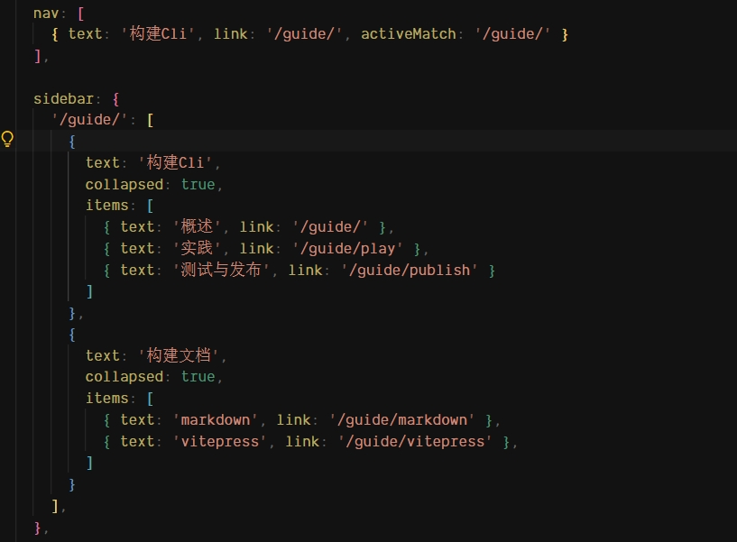

## 搭建文档

### [VitePress介绍](https://vitepress.dev)

VitePress 是一个静态站点生成器 （SSG），旨在构建快速、以内容为中心的网站。简而言之，VitePress 获取用 Markdown 编写的源内容，为其应用主题，并生成可以轻松部署到任何地方的静态 HTML 页面。

VitePress 可以单独使用，也可以安装到现有项目中。在这两种情况下，您都可以使用以下命令安装它：

::: code-group

```sh [npm]
$ npm add -D vitepress

```

```sh [pnpm]
$ pnpm add -D vitepress
```

```sh [yarn]
$ yarn add -D vitepress

```

```sh [bun]
$ bun add -D vitepress
```

:::

### 搭建 VitePress

::: code-group

```sh [npm]
$ npx vitepress init

```

```sh [pnpm]
$ pnpm dlx vitepress init
```

```sh [bun]
$ bunx vitepress init

```

:::

### 目录结构

```
|-- index.md
|-- package.json
|-- .vitepress
|   |-- config.mts
|   |-- theme
|       |-- index.ts
|       |-- style.css
|-- guide
|   |-- index.md
|   |-- markdown.md
|   |-- play.md
|   |-- publish.md
|   |-- vitepress.md
|-- images 
    |-- 1.png
    |-- 2.png

```
### 配置路由

